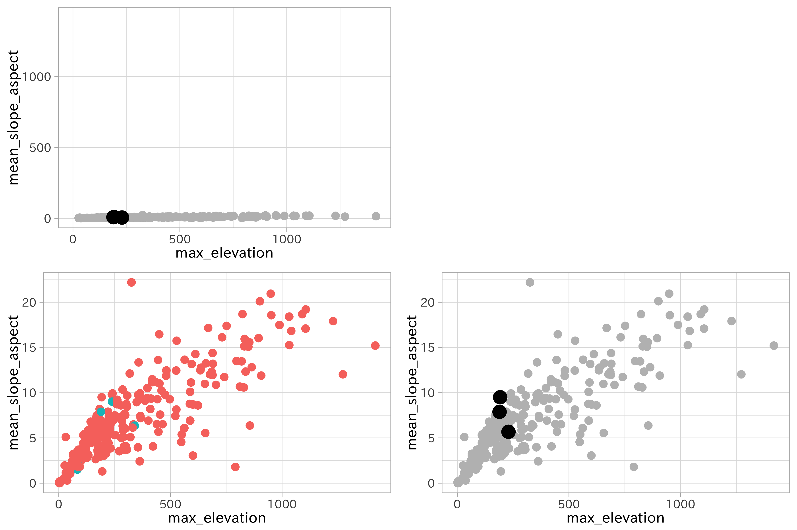

{:.input_area}
```R
source(here::here("R/setup.R"))
```


# tidyデータ: 人間にも機械にも優しいデータの記述形式

データが手に入ってすぐにモデルに利用できることはごく稀で、前処理と呼ばれる作業が必要になります。この作業はデータをモデルに流し込む前段階として必ず必要です。それはデータが欠損値や外れ値といった、扱いに困る値を含んでいることもありますが、多くのデータは入力の形式のまま利用可能ではなく、プログラムが処理しやすい形式へ整形することが求められるためです。

前処理の作業には、このようなデータ整形だけでなく、欠損値の削除や外れ値の削除も含まれます。またモデリングのために余分な列を除外したり、スケーリングの処理を施すなども必要です。そのため前処理を通したデータの質が統計モデリングや機械学習の学習効果に影響を及ぼします。ただしこれらはどのようなデータ、問題に対しても有効なものではなく、利用範囲には幅があります。

ここでは前処理を行わない際の問題点について触れ、tidyデータと呼ばれる形式へのデータ整形方法と一般的な前処理について紹介します。

## 前処理の必要性

前処理の必要性とその範囲は適用するモデルのタイプによって異なります。

木ベースのモデル（決定木、ランダムフォレスト）では、特徴量を入力とする複数のステップ関数（閾値を超えた場合に1, そうでなければ0に変換する）の組み合わせによって構成されるため変数のスケールの影響を受けません。しかしロジスティック回帰や部分最小二乗法、リッジ回帰や距離を利用するk-means、主成分分析など、多くのモデルは入力のスケールに敏感で、変数間のスケールを揃える必要があります。

### 前処理の必要性1: 重回帰モデル


{:.input_area}
```R
df_lp_kanto %>% 
  lm(posted_land_price ~ distance_from_station + acreage + night_population,
     data = .) %>% 
  tidy()
```


`distance_from_staion` の影響が一番強く、`acreage`、`night_population`が続きます。しかし `distance_from_staion` の値が大きすぎて他の変数の効果が小さいように見えます。これは元のスケールの影響を受けているためです。 `distance_from_staion` と `acreage` の1は同じ単位ではありません。偏回帰係数を比較する場合、スケーリングを行っておく必要があります。


{:.input_area}
```R
df_lp_kanto %>% 
  recipe(posted_land_price ~ distance_from_station + acreage + night_population) %>% 
  step_center(all_predictors()) %>% 
  step_scale(all_predictors()) %>% 
  prep() %>% 
  juice() %>% 
  lm(posted_land_price ~ .,
     data = .) %>% 
  tidy()
```


### 前処理の必要性2: 変数間のスケールが揃わない主成分分析

[主成分分析](../03/dimension-reduction)では入力に用いる変数間のスケールが標準化されていることが前提です。それは特徴量空間におけるデータ間を距離を利用するためです。そのため、値の範囲が大きく異なる変数があることでその影響を強く受けます。まずは標準化を行わない場合の結果を見てみましょう。


{:.input_area}
```R
pca_res <- 
  prcomp(~ distance_from_station + acreage + night_population, 
       data = df_lp_kanto,
       center = FALSE,
       scale. = FALSE)
# 主成分軸上のSDが大きく異なっていることに注意（単位の影響を強く受けている）
pca_res
# 第1主成分のみで累積寄与率が99%を超える
summary(pca_res)
```


次にあらかじめ標準化したデータを元に主成分分析を行った結果を見ます。


{:.input_area}
```R
pca_res <- 
  prcomp(~ distance_from_station + acreage + night_population, 
       data = df_lp_kanto,
       center = TRUE,
       scale. = TRUE)
# SDが小さくなる
pca_res
# 第2主成分軸まで含めて72%を説明
summary(pca_res)
```


### 前処理の必要性3: kNN


{:.input_area}
```R
library(FNN)
set.seed(12)

split_hazard <- 
  df_hazard_kys %>%
  select(hazard, max_elevation, mean_slope_aspect) %>% 
  drop_na() %>% 
  rsample::initial_split(strata = "hazard")

df_train <- training(split_hazard)
df_test <- testing(split_hazard)

knn_res <- knn(df_train, df_test, df_train$hazard, k = 2, prob = FALSE)
df_test$predict <- knn_res
attr(knn_res, "nn.index") %>% as.data.frame() %>% as_tibble() %>% .[21, ]


# get.knn(df_test %>% select_if(is.numeric), k = 2)["nn.index"] %>% as.data.frame() %>% .[397, ]

rec <- 
  df_train %>% 
  recipe(hazard ~ .) %>% 
  step_center(all_predictors()) %>% 
  step_scale(all_predictors())

df_train_baked <- 
  rec %>% 
  prep(training = df_train) %>% 
  bake(new_data = df_train)
df_test_baked <- 
  rec %>% 
  prep(training = df_train) %>% 
  bake(new_data = df_test)

knn(df_train_baked, df_test_baked, df_train_baked$hazard, k = 2) %>% 
  table()
```


{:.input_area}
```R
# p1 <-
#   ggplot(df_train, aes(max_elevation, mean_slope_aspect)) +
#   geom_point(aes(color = hazard))
# 
# # p1 + 
# #   ylim(range(df_train$max_elevation))
# # 
# # plot_grid(p1, p2)
```


{:.input_area}
```R
p2 <-
  ggplot(df_test,
       aes(max_elevation, mean_slope_aspect)) +
  geom_point(aes(color = predict))

p3 <- 
  p2 + 
  scale_color_manual(values = c("gray", "gray")) +
  geom_point(data = df_test %>% 
               slice(c(397, 147, 271)), 
         aes(max_elevation, mean_slope_aspect),
      #   color = "transparent",
         size = 3)

# わかりにくいけど、スケールを揃えたら距離が離れる点が近隣として選ばれている
plot_grid(p3 +
  ylim(range(df_test$max_elevation)) +
    guides(color = FALSE), NULL,
  p2 + guides(color = FALSE), 
  p3 + guides(color = FALSE))
```




<!-- ### 前処理の必要性4: SVM -->

## スケーリング処理

変数間のスケールを統一する処理には複数の方法があります。いずれもデータが取りうる値のスケールを変換し、一定の範囲に収める処理を行います。これらは個々の特徴量に対して適用され、後に述べるような対数変換のようにデータの分布を変化させない変換方法になります。

PLSなどで恩恵がありますが

一方でデータが持つ単位を失ってしまうことは、データの解釈を困難にさせます。

これらのスケーリング処理はデータの分布には影響しないことが特徴です。

### Min-Maxスケーリング

特徴量の値を0~1の範囲に収める変換をMin-Maxスケーリングと呼びます。

$$
\tilde{x} = \frac{x - min(x)}{max(x) - min(x)}
$$

Min-Maxスケーリングを行う際は、数値の取り得る値があらかじめわかっているものが望ましいです。データとして存在しない値や外れ値が与えられることで、その値に引っ張られて相対的な差がなくなってしまう恐れがあるからです。


{:.input_area}
```R
# 地価データの「最寄り駅までの距離」の範囲
lp_dist <- df_lp_kanto$distance_from_station
range(lp_dist)
```


{:.input_area}
```R
lp_dist_minmax <- 
  scale(lp_dist, center = min(lp_dist), scale = (max(lp_dist) - min(lp_dist)))
range(lp_dist_minmax)
```


全体を考慮


{:.input_area}
```R
p1 <- 
  ggplot(df_lp_kanto, aes(x = 0, y = distance_from_station)) +
  geom_violin(color = ds_col(1))

p2 <- 
  ggplot(data = NULL, aes(0, lp_dist_minmax[, 1])) +
  geom_violin(color = ds_col(5)) +
  ylab("min_max(lp_dist)")

plot_grid(p1, p2)
```


- 外れ値が含まれていない場合に良い
- 外れ値の情報を活用したい時には適さない

### 標準化

標準化 (standardization)... 平均0、分散（標準偏差）1になる。

$$
\tilde{x} = \frac{x- mean(x)}{sqrt(var(x))}
$$

- 複数の変数に対して行うことで比較が可能になる (平均0, 標準偏差1)
- 範囲スケーリング... 最大値、最小値を利用する
- 共通の「単位」をもつように扱いたい場合に有効
    - 距離または内積を利用する --> KNN, SVMs
    - ペナルティを課すため --> lasso, ridge

を標準化 (standardization) と呼びます。具体的には変数の取りうる値を平均0、分散1に変換する処理です。

<!-- あとで独立させる -->


{:.input_area}
```R
# スケーリングでは分布は変わらない
range(df_lp_kanto$posted_land_price)
p_base <- 
  df_lp_kanto %>% 
  ggplot(aes(x = posted_land_price)) +
  geom_histogram(bins = 30)
p_base
df_lp_kanto %>% 
  ggplot(aes(x = scale(posted_land_price, center = TRUE, scale = TRUE)[, 1])) +
  geom_histogram(bins = 30)

# hist(df_lp_kanto$posted_land_price)
# hist(scale(df_lp_kanto$posted_land_price)[, 1])
```


リッジ回帰、主成分分析では変数の標準化が前提となっている

### 正規化

正規化 (normalization)

取りうる値の範囲が狭くなります。これは外れ値に対して有効な処理と言えます。

体重や身長など、単位が異なる変数を比較する際に役立ちます。

正規化により、取りうる値の範囲が統一されるためです。

データの表現方法を変える


{:.input_area}
```R
# 地価データにおける駅からの距離
# 平均と分散
df_lp_kanto %>% 
  summarise(mean = mean(distance_from_station),
            sd = sd(distance_from_station))

# center, scale引数はいずれも既定でTRUEです
lp_dist_scaled <- 
  c(scale(df_lp_kanto$distance_from_station, center = TRUE, scale = TRUE))

mean(lp_dist_scaled) # 限りなく0に近くなる
sd(lp_dist_scaled) # 分散は1
```


{:.input_area}
```R
diff(range(lp_dist))
median(lp_dist)

diff(range(c(scale(lp_dist))))
```


標準地からの鉄道駅までの距離の中央値は900で、最小値は0 (近接の場合は0が与えられる)、最大値は24000です。この特徴量を標準化するとその差は14.02にまで縮まります。

距離の

これらの手法は、対数変換と異なりデータの分布には影響しないことが特徴です。


{:.input_area}
```R
p1 <- 
  ggplot(df_lp_kanto, 
             aes(distance_from_station)) +
  geom_histogram(bins = 30, fill = ds_col(1))
p2 <-
  ggplot(df_lp_kanto,
             aes(c(scale(distance_from_station)))) +
  geom_histogram(bins = 30, fill = ds_col(5)) + 
  scale_fill_identity() + aes(fill = ds_col(1))

plot_grid(p1, p2, ncol = 2)
```


## データ浄化

<!-- 外れ値、欠損処理は簡単に（あとでそれぞれ解説するため）。外れ値はここだけ？ -->

1. 情報を含まない列の削除
    - 分散が0の説明変数 (constant cols)
    - 重複した説明変数を一つに
        - 多重共線性
    - 相関係数が1である説明変数の組 (perfectly correlated cols) をユニークに
        - データリーク

データセットに含まれる列のうち、`attribute_change_forest_law` と `attribute_change_parks_law` は論理型の変数でありながら1値しか持たない（分散が0）ものでした。

### 外れ値

### 欠損処理


### 不要な列の削除

特徴量選択の文脈においてはフィルタ法

... 情報量がない列

単一の変数についてと、変数間の関係をそれぞれ調べることが重要になります。

もう一度データを確認しておきましょう。

<!-- 前に触れている?? EDAがさきにくるか後に来るか -->

<!-- 特徴量選択の時にも役立つtips... filter法 -->

- 変数内
    - 単一の値のみが含まれる変数 (分散0)
- 変数間
    - 同一の値の組み合わせ
    - 相関係数が1になる
- データセット全体
    - 完全に欠損する行・列


{:.input_area}
```R
df_lp_kanto %>% skimr::skim_to_list()
```


`attribute_change_forest_law` と `attribute_change_parks_law` の列は二値データを持つことができる変数ですが、いずれも一つの値しか記録されていません。変数内での分散は0となり、情報を持っていないのと同義です（標準化も適用できません）。そのためこれらの値はモデル構築の前にデータから削除しても問題ないと考えられます。

情報量がゼロ（分散ゼロ）

数値データでは稀ですが、論理値変数やカテゴリ変数に潜んでいる、こうした1種類の値しか取らないデータは除外しましょう。


{:.input_area}
```R
scale(c(0, 0, 0), scale = TRUE)
```


{:.input_area}
```R
df_lp_kanto_clean <- 
  df_lp_kanto %>% 
  verify(ncol(.) == 45) %>% 
  as.data.frame() %>% 
  remove_constant() %>% 
  as_tibble() %>% 
  verify(ncol(.) == 43)

dim(df_lp_kanto_clean)
```


<!-- df_hazard_kyusyu では constantがない-->

このデータの場合、これ以外で単独の値しか持たない変数はありませんでした。

どうやら違うようです。


{:.input_area}
```R
df_lp_kanto %>% 
  distinct(attribute_change_urban_planning_area, 
           attribute_change_use_district)
```


分散が0に近い変数を削除する

変数の数は減りますが、重要な変数を削除してしまう恐れがあります。この作業は慎重に


{:.input_area}
```R
dim(df_lp_kanto_clean)

nzv_filter <- 
  df_lp_kanto_clean %>%
  recipe(~ .) %>% 
  step_nzv(all_predictors())

filtered_te <- 
  nzv_filter %>% 
  prep() %>% 
  juice() %>% 
  verify(ncol(.) == 28)

dim(filtered_te)

# 削除される列がどのような値を持っているか確認して
df_lp_kanto_clean %>% 
  select(names(df_lp_kanto_clean)[!names(df_lp_kanto_clean) %in% names(filtered_te)]) %>% 
  glimpse()

# 重要ではなさそうなので削除
df_lp_kanto_clean <- filtered_te
```


{:.input_area}
```R
# 変わらん（正しい）
# df_hazard_kys %>% 
#   as.data.frame() %>% 
#   remove_empty("cols") %>% 
#   dim()
```


相関係数が高い変数を

多重共線性の問題を引き起こします。

いずれかの変数だけを利用するようにしましょう。


{:.input_area}
```R
df_lp_kanto_clean %>% 
  select(-starts_with(".")) %>% 
  select_if(is.numeric) %>% 
  corrr::correlate()

# 最大 0.79... building_coverage - floor_area_ratio
df_lp_kanto_clean %>% 
  select(-starts_with(".")) %>% 
  select_if(is.numeric) %>% 
  ggcorr(label = TRUE, label_round = 2)

df_hazard_kys %>% 
  select(-block_no, -longitude, -latitude) %>% 
  select_if(is.numeric) %>% 
  ggcorr(label = TRUE, label_round = 2)
```


{:.input_area}
```R
# df_lp_kanto では不適切

df_lp_kanto_clean %>% 
  recipe(~ .) %>% 
  step_corr(all_numeric(), -starts_with("."), threshold = 0.9) %>% 
  prep() %>% 
  juice() %>% 
  verify(ncol(.) == 28L)

# 閾値を低くする
df_lp_kanto_clean %>% 
  recipe(~ .) %>% 
  step_corr(all_numeric(), -starts_with("."), threshold = 0.75) %>% 
  prep() %>% 
  juice() %>% 
  verify(ncol(.) == 27L)
```


テキストデータの前処理については[別の章](../02/text)で解説します。

### 次元削減と特徴量抽出

元データの情報を可能な限り多く含んだ状態を維持しつつ、新たな特徴量を抽出するプロセスとして[次元削減](../03/dimension-reduction)があります。主成分分析に代表されるように、これらの手法は高次元のデータのばらつきをより失わない方法で圧縮します。。特に主成分分析では高次元空間上に直交するベクトルを特徴量（成分）とすることから、入力に相関のある特徴量を与えても無相関の特徴量を得ることが可能です。

なお主成分分析は変数のスケールの影響を強く受けます。実行する前にはスケーリング処理を行うようにしましょう。主成分分析を含めた次元削減の実行については[次元削減](../03/dimension-reduction)で解説します。

## 関連項目

- [次元削減](../03/dimension-reduction)
- [特徴量選択](../03/feature-selection)

## 参考文献

- Max Kuhn and Kjell Johnson (2013). Applied Predictive Modeling. (Springer)
- 本橋智光 (2018). 前処理大全 (技術評論社)
- Max Kuhn and Kjell Johnson (2019).[Feature Engineering and Selection: A Practical Approach for Predictive Models](https://bookdown.org/max/FES/) (CRC Press)
