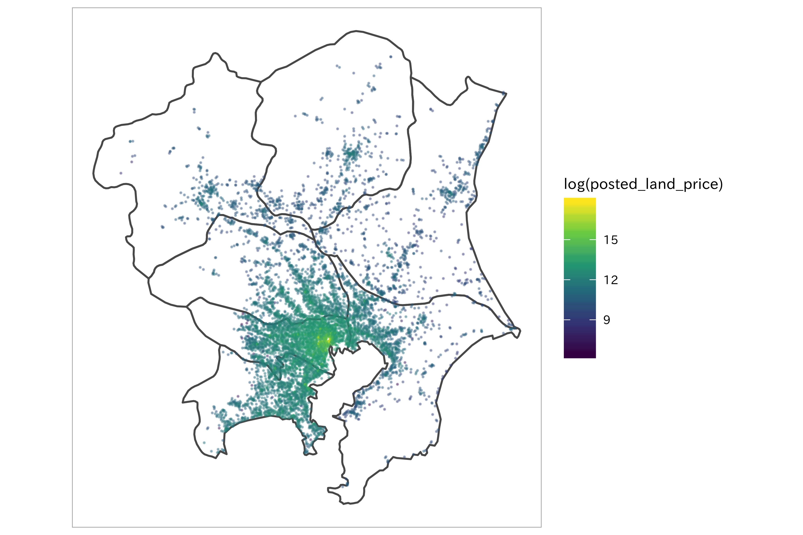

# モデルワークフロー

前章までにデータ分析のワークフローを紹介し、実際にデータの可視化や前処理を行いました。残るステップはモデルの実行です。しかし、EDAと前処理、モデルの実行は繰り返しの作業であることは最初に述べた通りです。最初に構築したモデルが最終的なレポートに使われることはなく、モデルの結果を評価し、そこからさらなる処理を加えていくことでモデルを磨き上げていくのが一般的です。

ここで、Max Kuhn and Kjell Johnson (2019)
が示したモデルワークフローを紹介します。ここにはモデルの実行だけでなく、[モデルの評価](../03/model-performance)や[ハイパーパラメータの探索](../03/parameter-tuning)と呼ばれる作業の他、EDAや特徴量エンジニアリングが含まれます。順を追って解説します。


まずaからbの段階は前章までで扱ったEDAや定量分析の作業です。次のcのステップに到達するまでにそれぞれ反復があることを想定しています。というのも、EDAによるデータの可視化、定量化と次のモデル構築は1セットのような関係にあり、各作業で得た知識を活かして改善するという手順を踏みます。データについて十分な洞察を得たのちに、ステップcへと進みます。

cは特徴量エンジニアリングの過程です。最初の特徴量エンジニアリングでは、これまでの仮説に基づいて初期モデルに適用する特徴量を生成します。次のdはいよいよモデルの実行です。ここでは初期の特徴量セットを使い複数のモデルを構築します。重要なのは、モデルの実行と評価がセットになっている点です。これがステップeで行われます。モデルの汎化性能を評価する指標は問題や課題設定により異なります。

モデルの実行は一般的にはシンプルなものから始めるのが良いとされます。複雑なモデルでは計算コストが高くなりがちなことや、結果の解釈が困難になるという欠点があります。対してシンプルなモデルはその逆です。また、思わぬところでデータの異常に気がつくかもしれません（前処理が十分でなかった、予測性能が明らかに高くなりすぎた（過学習やデータリークの可能性）など）。シンプルなモデルから複雑なモデルにしていく作業は
逆の手順よりも簡単なように思えます。複数の変数がモデルに組み込まれている場合、どの変数が目的変数に対して重要であるかを[変数重要度](../03/feature-selection)により見ていくことになり、その判断に困ることがあるためです。変数重要度については後の章で解説します。しかしデータの性質や過去の経験を活用できる場合にはこの通りではありません。状況に応じた戦略を使い分けるべきでしょう。

モデルの結果を利用して残差分析などの可視化を行うのがステップfです。ステップgになると再び特徴量エンジニアリングの作業です。ここでは初期モデルをベースにした特徴量エンジニアリングが行われます。この段階で、性能の低いモデルのいくつかは除外され、最終的な選考には数個のモデルが残っています。このモデルに対して、性能を改善するような特徴量エンジニアリングとモデル調整がステップhで行われます。iでの最終モデルの性能評価は、外部のテストデータセットに対して行われます。このデータはモデルの学習中には見ることができなかった未知のデータでなければいけません。このデータへの汎化能力が高ければ、構築したモデルは成功と言えるでしょう。iで選ばれた最終モデルはjのステップへと進み、実データを適用する運用段階に入ります。

iの段階でモデルの汎化能力を元に最終テストが行われましたが、ここで思うような性能が出なかった場合はどうすれば良いでしょう。一般的に、モデルが過学習を起こしている場合、学習段階で良かった性能がテストデータに対しては性能の低い結果を導きます。これを防ぐには、より早い段階での[データ分割](../03/data-splitting)と交差検証による性能評価が欠かせません。

モデルの開発過程を通じて考慮すべきこととして以下のものがあります。

  - 過学習への対策としての[データ分割](../03/data-splitting)
  - モデルの[汎化性能を評価するための指標](../03/model-performance)の選択
  - 複数のモデルによる比較と[特徴量の選択](../03/feature-selection)
  - [ハイパーパラメータの探索と調整](../03/parameter-tuning)
  - [モデルの解釈](../03/interpretability)

これらについては本書の後半で解説します。

## 地価公示データを例に

ここでは地価公示データを例に、モデル実行と汎化性能の評価までを一貫して行う例を見ていきたいと思います。本来はここにパラメータ探索の作業も含まれますが省略します。なお探索的データ分析、クレジングによりデータをモデルに投入するための用意ができているものとします。

モデル構築に取り掛かる前に、まずは問題と性能評価のための方針を改めて確認しておきましょう。地価公示データの問題は、地価公示価格に関連する土地的な要因をもとに、地価公示価格を予測するという回帰のタスクです。あらかじめ価格についてのデータは
`posted_land_price` の列に記録されているため、教師付き学習になります。

### 評価指標の選択

回帰問題での典型的な評価指標として、決定係数 (coefficient of determination: RSQ,
\(R^2\))や二乗平均平方根誤差 (Root Mean Square Error: RMSE)
が利用されます。これらの指標についての説明は後述しますが、ここでは決定係数、RMSEに加え平均絶対誤差
(Mean Absolute Error: MAE)
を性能評価のための指標として選択します。

決定係数は回帰モデルのあてはまりの良さを判断する目安（説明変数が目的変数をどれくらい説明できているか）として利用され、1に近いほど当てはまりが良いとします。RMSEは個々の予測値の誤差を2乗してから平均して、平方根をとったものです。常に正の値となり、モデルの誤差の大きさを示す指数となります。値が0に近いほど0に近いほど回帰モデルの性能が高いことを示します。またMAEはモデルの平均的な誤差の大きさを示す指標として利用でき、外れ値の影響を受けにくいとされます。この指標もRMSEと一緒で0に近いほど回帰モデルの性能が高いと判断します。

{:.input_area}
```R
reg_perf_metrics <- metric_set(rmse, rsq, mae)
```

<!-- - 残差プロット -->

<!-- 位置情報データの扱いは後でやるのでここでは議論しない。無視する -->

<!-- バイアスと分散のトレードオフ-->

### データの分割

構築したモデルが機能するのか、出力される値に対する評価を事前にしておく必要があります。

モデルの運用段階では、モデルは未知のデータに対する予測・分類を行わなくてはいけないですが、この段階で未知のデータは手に入れられません。そこで、手元のデータセットをモデルの学習用と性能評価用に分割し、評価するという方法を取るのが一般的です。モデルの学習に用いられるデータセットを分析セット
(analysis set)、モデルの学習中には利用されず、汎化性能を評価するために用いるデータセットを評価セット (assessment
set)と呼びます（訓練データ、テストデータ）。

データ分割の方法は[後の章](../03/data-splitting)で述べるように、データのサイズや構造に応じて柔軟に対応しなければなりませんが、ここではHold-out検証と呼ばれる、データセットをランダムに分割する方法を採用します。次のコードで、データセットの3/4を分析セットに、残りをテストセットとして振り分けます。

{:.input_area}
```R
# 分析セットと評価セット
set.seed(123)
lp_split <- 
  df_lp_kanto_clean %>% 
  initial_split(prop = 3/4)
df_lp_train <- training(lp_split)
df_lp_test <- testing(lp_split)
```

ここでデータの分割が正しくできているか、確認のために可視化を行うことが望ましいです。例えば、データ分割をランダムに行ったと言えどデータに偏りがあるかもしれません（ここではグループや空間的なデータのばらつきは無視しています。本来は考慮しなくては良い性能が出なかったり、データ漏洩になる恐れがあります）。分析セットと評価セットのデータの分布やカテゴリデータの場合であれば均等な割合で抽出されているか、時系列データにおいて未来のデータが分析セットに混在していないか、注意深く確認するべきでしょう。

### 初期モデルの作成

地価公示データを使って、地価公示標準地の土地の面積と位置（緯度と経度）が価格に影響するという単純なモデルを考えてみます。これは複数の説明変数によって目的変数を説明しようという重回帰モデルになります。ここでは線形回帰モデルとサポートベクトルマシン
(SVM) を用いてモデルを作成し比較します。

\[
land\_price = \beta_0 + \beta_1 acreage + \beta_2 longitude + \beta_3 latitude + \epsilon
\]

{:.input_area}
```R
mod_formula <- formula(posted_land_price ~ acreage + .longitude + .latitude)
```

{:.input_area}
```R
# モデルを定義... 線形回帰モデル
spec_lm <- 
  linear_reg() %>% 
  set_engine(engine = "lm")
```

```R
ggplot() +
  geom_sf(data = ne_knt, fill = "transparent")  +
  geom_sf(data = df_lp_kanto_clean %>% 
            sf::st_as_sf(coords = 
                           c(".longitude", ".latitude"), 
                         crs = 4326),
          aes(color = log(posted_land_price)),
          size = 0.1,
          alpha = 0.35) +
  coord_sf(datum = NA) +
  scale_color_viridis_c()
```



{:.input_area}
```R
lp_simple_recipe <- 
  df_lp_train %>% 
  recipe(mod_formula) %>% 
    # 対数変換により正規分布に近づける
  step_log(all_outcomes(), all_predictors(), base = 10) %>% 
  prep(training = df_lp_train)

# 特徴量エンジニアリングによるデータ加工の手順は評価セットに対しても行います
df_lp_train <- 
  lp_simple_recipe %>% 
  bake(new_data = df_lp_train)
df_baked <- 
  lp_simple_recipe %>% 
  bake(new_data = df_lp_test)

df_baked %>% 
  glimpse()
```

    ## Observations: 2,119
    ## Variables: 4
    ## $ posted_land_price <dbl> 3.618048, 4.361728, 4.732394, 4.552668, 4.545…
    ## $ acreage           <dbl> 2.501059, 2.260071, 2.089905, 2.711807, 2.503…
    ## $ .longitude        <dbl> 2.141570, 2.142670, 2.142675, 2.142695, 2.142…
    ## $ .latitude         <dbl> 1.561926, 1.560818, 1.559397, 1.560245, 1.559…

{:.input_area}
```R
fit_lm <- 
  fit(
    spec_lm,
    mod_formula,
    data = df_lp_train)

tidy(fit_lm)
```

    ## # A tibble: 4 x 5
    ##   term        estimate std.error statistic   p.value
    ##   <chr>          <dbl>     <dbl>     <dbl>     <dbl>
    ## 1 (Intercept)  218.      13.1        16.7  4.00e- 61
    ## 2 acreage       -0.159    0.0160     -9.93 4.34e- 23
    ## 3 .longitude   -54.2      6.17       -8.78 2.15e- 18
    ## 4 .latitude    -61.7      1.60      -38.6  1.17e-292

{:.input_area}
```R
fit_lm %>% 
  predict(new_data = df_lp_train) %>% 
  bind_cols(df_lp_train) %>% 
  reg_perf_metrics(truth = posted_land_price, estimate = .pred)
```

    ## # A tibble: 3 x 3
    ##   .metric .estimator .estimate
    ##   <chr>   <chr>          <dbl>
    ## 1 rmse    standard       0.488
    ## 2 rsq     standard       0.240
    ## 3 mae     standard       0.360

{:.input_area}
```R
# modelr::rmse(fit_lm$fit, df_lp_train)
# glance(fit_lm$fit)
```

分析セットでのRMSEは0.488、決定係数は0.211となり、まだ適合不足のような結果です。今度は同じ特徴量セットで、SVMを実行してみます。精度はどう変化するでしょうか。

{:.input_area}
```R
mod_svm <- 
  svm_rbf(mode = "regression", cost = 1)

fit_lm <- 
  fit(
    mod_svm %>% 
      set_engine("kernlab"),
    mod_formula,
    data = df_lp_train)

fit_lm %>% 
  predict(new_data = df_lp_train) %>% 
  bind_cols(df_lp_train) %>% 
  reg_perf_metrics(truth = posted_land_price, estimate = .pred)
```

    ## # A tibble: 3 x 3
    ##   .metric .estimator .estimate
    ##   <chr>   <chr>          <dbl>
    ## 1 rmse    standard       0.236
    ## 2 rsq     standard       0.827
    ## 3 mae     standard       0.154

線形回帰の結果よりも精度が向上しました。この特徴量セットでは線形回帰モデルよりもSVMの方がパフォーマンスが良さそうということがわかりました。SVMではさらにハイパーパラメータを最適化する必要がありますが、ここではその手順を省略し、このモデルを用いて最後のモデル評価へと進みます。

### モデル評価

{:.input_area}
```R
fit_lm %>% 
  predict(new_data = df_baked) %>% 
  bind_cols(df_baked) %>% 
  reg_perf_metrics(truth = posted_land_price, estimate = .pred)
```

    ## # A tibble: 3 x 3
    ##   .metric .estimator .estimate
    ##   <chr>   <chr>          <dbl>
    ## 1 rmse    standard       0.251
    ## 2 rsq     standard       0.799
    ## 3 mae     standard       0.167

RMSEは0.252、決定係数は0.797と最初のモデルとしては十分な結果が得られたかと思います。価格に対して土地の面積が効くという仮説は間違っていないようです（他の変数についても試す必要がありますが）。しかしここがスタート地点です。この結果を良くも悪くも捉えすぎないようにしましょう。改善すべきポイントはたくさんあるはずです。重要なのはモデルを当てはめるための仮説とデータ変換と、そして実行と性能評価の過程がシームレスに繋がっていることです。次の章以降では、地価公示データをはじめとしたサンプルデータでの特徴量エンジニアリングの方法を探していきます。

## まとめ

## 関連項目

  - [データ分割](../03/data-splitting)
  - [モデルの性能評価](../03/model-performance)

## 参考文献

  - Aurélien Géron (2017). Hands-On Machine Learning with Scikit-Learn
    and TensorFlow (O’Reilly) (**翻訳** 長尾高弘訳 (2018).
    scikit-learnとTensorFlowによる実践機械学習 (オライリー))
  - 有賀康顕、中山 心太、西林孝 (2018). 仕事ではじめる機械学習 (オライリー)
  - Max Kuhn and Kjell Johnson (2019). [Feature Engineering and
    Selection: A Practical Approach for Predictive
    Models](https://bookdown.org/max/FES/) (CRC Press)
