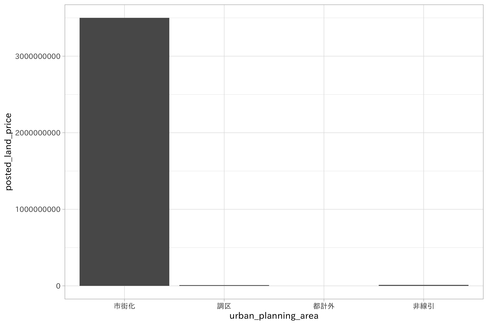
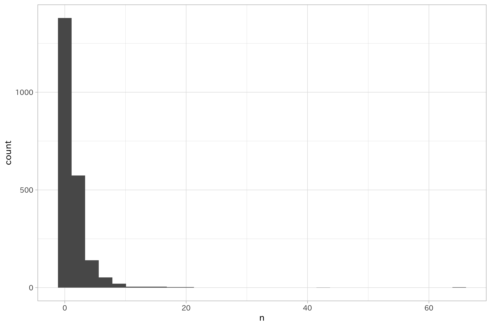

{:.input_area}
```R
source(here::here("R/setup.R"))
```


# カテゴリデータの取り扱い

項目やラベルを区別するために与えられる、文字列または数値の集合をカテゴリと呼びます。ここではカテゴリ変数に含まれる値を水準と呼びます。カテゴリ変数の例として、地名や行政名、職業などがあります。カテゴリの特徴は有限の集団であることで、数値への置き換えも可能です。しかしカテゴリには通常、大小関係はありません。すなわち名義尺度です。このようなデータは非順序データ (non-ordinal data) と呼ばれます。非順序データに対して、大小の区分のあるカテゴリデータもあります。例えば、大相撲の番付には明確な階級があります（横綱、大関、関脇、小結、前頭、これらはさらに幕内というカテゴリに属します。また幕内の下に十両が存在します）。これは順序データ (ordinal data) です。順序データの場合、さらに水準に対して「重み」が存在する可能性があります。

カテゴリは「どれだけ違うか」ではなく「値が異なる」ことが重要な判断基準となります。すなわち、観客数5000人と観客数1000人はその差を求めることができ、カテゴリとして扱うより数値として扱うべきということになります。一方で、数値のように扱える郵便番号などは数値として扱うことは避けるべきです。これらは数値であっても大小関係や連続的な意味をもたないためです。

カテゴリは時に大規模になります。顧客データを例にとると、ユーザを識別するIDはサービスを利用するユーザ数が増えれば増えるほど大きくなり、計算コストが高くなってしまいます。そこでより多くのカテゴリ数に対応できる特徴量エンジニアリングが求められます。

ここでは順序のない・あるカテゴリを扱うための特徴量エンジニアリングの手法を紹介します。まず、ダミー変数化はカテゴリデータに対して広く利用されるものでいくつかの形態があります。次に、より多くのカテゴリ数や、新たなカテゴリの水準に対応する方法としてビンカウンティングなどを取り扱います[^1]。

[^1]: カテゴリを数値に変換する処理は全般的にエンコーディングと呼ばれます。これは、カテゴリが持つ情報をエンコードして数値に変換する作業を踏襲した命名です。


{:.input_area}
```R
library(cattonum)
library(FeatureHashing) # 特徴量ハッシング

df <- 
  tibble(
  feature = c("A", "A", "A", "A", "B", "B", "C", "C"),
  outcome = as.numeric(c(TRUE, FALSE, FALSE, FALSE, TRUE, FALSE, TRUE, TRUE))) %>% 
  add_count(feature)
```


## カテゴリデータの例

地価公示価格データは多くのカテゴリ変数をもっています。


{:.input_area}
```R
df_lp_kanto %>% 
  select_if(is.character)
```


土砂災害・雪崩メッシュデータにはカテゴリ変数として6つの変数が含まれます。都道府県名 (`prefecture`)、発生場所を示す市区町村名(`cityName`) 、災害の種類 (`hazardType`) 、災害の種類の詳細 (`hazardType_sub`)、勾配 (`inclination`)、メッシュコード (`meshcode`)の6つです。ここではこれらのデータへの特徴量エンジニアリングを試みることにします。


{:.input_area}
```R
# データフレームの文字列の列を選択します
df_hazard %>% 
  select_if(is.character)
```


私たちは都道府県名は最大で47の値があることを知っています。市町村名はそれより多いでしょう。しかし災害の種類 (`hazardType`) 、災害の種類の詳細 (`hazardType_sub`)、勾配 (`inclination`)にどのような値が含まれるかは把握できていません。カテゴリ変数の特徴量エンコーディングを実施する前に、どのような値が存在するか、その頻度と一緒に確認しておきましょう。

災害の種類をカウントします。災害の種類を記録する列として `hazardType`、`hazardType_sub`の2種類があります。がけ崩れ、地すべりでは災害種類の詳細を示す `hazardType_sub` が存在しないこともわかりました。また、2つの変数で頻度を集計すると、いくつかの組み合わせではわずかな頻度のものもあることがわかります。対してがけ崩れには `hazardType_sub` がなく、全体の7割近くを占めていることが判明しました。


{:.input_area}
```R
df_hazard %>% 
  count(hazardType, hazardType_sub) %>% 
  arrange(hazardType)
```


続いて勾配 (`inclination`)です。勾配は連続変数として数値化が可能なように見えます。このことは覚えておきましょう。


{:.input_area}
```R
df_hazard %>% 
  count(inclination)
```


ビールの支出データについては、カテゴリ変数は当日の日中の天候を記録した `weatherdaytime_06_00_18_00` のみです。


{:.input_area}
```R
df_beer2018q2 %>% 
  count(weatherdaytime_06_00_18_00)
```


## ダミー変数化

カテゴリ変数を数値に変換する処理として最も一般的なのが、カテゴリ変数をダミー変数化してしまうことです。カテゴリに含まれる水準の値を特徴量に直接用いるもので、ダミーコーディング、One-Hotエンコーディング、effectコーディングの3種類があります。これらはカテゴリに含まれる$k$種類の値を特徴量として扱う際の挙動が異なります。

### ダミーコーディング

ダミーコーディングは統計分析でも広く使われるカテゴリ変数の数値化手法です。該当する値を含む場合に1、そうでなければ0を各特徴量に与えます。ダミーコーディングではカテゴリが取りうる数、自由度 $k-1$の特徴量を生成します。自由度 $k-1$ で十分である理由は、他のダミー変数の値から残りの一つの値が推測可能だからです。

具体例で示しましょう。3つの水準 (A, B, C)をもつカテゴリ変数をダミーコーディングすると、2つの特徴量ができます。ここでは`feature_B`,`feature_C`という名前をつけました。ここで、Aをもつデータを探すのは簡単です。ダミー変数には0と1の値が格納され、該当しない場合には0ですので`feature_B`,`feature_C`両方で0のデータがAになります。Aのようなダミー変数に含まれないカテゴリは参照カテゴリと呼ばれます。参照カテゴリに対して、`feature_B`、`feature_C`の値が決まります。


{:.input_area}
```R
df %>% 
  recipe(~ feature) %>% 
  step_dummy(feature) %>% 
  prep() %>% 
  juice()
```


ダミーコーディングを利用したモデリングはその結果の解釈が容易になります。これを地価公示データの都市計画区分 (`urban_planning_area`) をダミー変数化することで示しましょう。都市計画区分の列は次に示すように4つの値を取りますが、1つを参照カテゴリとして扱い、3つのダミー変数で表現することになります。


{:.input_area}
```R
unique(df_lp_kanto$urban_planning_area)
```


{:.input_area}
```R
df_lp_kanto_dummy_baked <- 
  df_lp_kanto %>% 
  recipe(posted_land_price ~ .) %>% 
  step_dummy(urban_planning_area) %>% 
  prep() %>% 
  bake(posted_land_price, starts_with("urban_planning_area"), new_data = df_lp_kanto)

df_lp_kanto_dummy_baked
```


都市計画区分の情報のみを使って、公示価格を予測する線形回帰モデルを適用します。


{:.input_area}
```R
df_lp_kanto_dummy_baked %>% 
  lm(posted_land_price ~ ., data = .) %>% 
  tidy()
```


推定された結果の切片は、参照カテゴリの平均値を示します。つまり「市街化」の効果です。市街化に対して、他の係数はいずれも負値を取っています。この値は各カテゴリの平均値と切片（参照カテゴリ）との差を示します。これは市街化の影響が地下価格に影響し、他のカテゴリは効果が小さいことを示す結果です。ダミーエンコーディングではカテゴリの水準の一つを切片として利用可能なため、モデルの解釈が容易になるのです。


{:.input_area}
```R
df_lp_kanto %>% 
  ggplot(aes(urban_planning_area, posted_land_price)) +
  geom_bar(stat = "identity")
```




<!-- なお複数のカテゴリ変数をダミーエンコーディングする場合、参照セルは多次元になります。-->

<!-- フルランク未満のエンコーディングは One-Hotエンコーディング -->

### One-Hotエンコーディング

カテゴリ変数に含まれる項目を新たな列として扱い、各列の値には0または1を与えていく方法をOne-Hotエンコーディングと言います。カテゴリに該当する場合は1、そうでない場合には0を与えていく方法です（ある要素が1で他の要素が0であるようにする表現をOne-Hot表現と呼びます）。ダミー変数とは異なり、カテゴリの水準数kの数だけダミー変数が作成されるのが特徴です。

先と同じく、地価公示データの都市計画区分 (`urban_planning_area`) にOne-Hotエンコーディングを適用してみます。


{:.input_area}
```R
df_lp_kanto %>% 
  recipe(~ .) %>% 
  step_dummy(urban_planning_area, one_hot = TRUE) %>% 
  prep() %>% 
  bake(starts_with("urban_planning_area"), new_data = df_lp_kanto)
```


今回はカテゴリの水準数が4であったために4つの特徴量が新たに作られました。

### effectコーディング

ダミーコーディングのように、参照カテゴリを利用するダミー変数化の方法としてeffectコーディングがあります。しかしeffectコーディングでは参照カテゴリは-1のベクトルで表現されます。


{:.input_area}
```R
df %>% 
  recipe(~ .) %>% 
  step_dummy(feature) %>% 
  prep() %>% 
  juice() %>% 
  mutate(feature_B = if_else(feature_B == 0 & feature_C == 0,
                             -1,
                             feature_B),
         feature_C = if_else(feature_B == -1 & feature_C == 0,
                             -1,
                             feature_C))
```


effectコーディングの利点として、ダミーコーディングよりも結果の解釈が簡単ということがあります。ダミーコーディングを適用したデータ同様に、地価価格を予測する線形回帰モデルを実行してみましょう。


{:.input_area}
```R
dummy_lm_res <- 
  df_lp_kanto_dummy_baked %>% 
  mutate(urban_planning_area_調区 = if_else(urban_planning_area_調区 == 0 & urban_planning_area_都計外 == 0 & urban_planning_area_非線引 == 0,
                             -1,
                             urban_planning_area_調区),
         urban_planning_area_都計外 = if_else(urban_planning_area_調区 == -1 & urban_planning_area_都計外 == 0 & urban_planning_area_非線引 == 0,
                             -1,
                             urban_planning_area_都計外),
         urban_planning_area_非線引 = if_else(urban_planning_area_調区 == -1 & urban_planning_area_都計外 == -1 & urban_planning_area_非線引 == 0,
                                           -1,
                                           urban_planning_area_非線引)) %>% 
  lm(posted_land_price ~ ., data = .) %>% 
  tidy()
dummy_lm_res
```


effectコーディングでは、切片はターゲットとなる変数の全体平均を表し、係数は各カテゴリの平均値と全体平均との差分を表します。このことにより、各カテゴリの効果 (main effect) を主眼に捉えることができます。なお参照カテゴリの係数を算出するにはカテゴリの係数を合計してマイナスをつけます。


{:.input_area}
```R
-sum(dummy_lm_res$estimate[-1])
```


ダミーエンコーディングの結果と同じく、参照カテゴリの「市街化」の効果が大きく、他のカテゴリによって平均が低くなっていることがわかりました。

### ダミー変数化の短所

これまでカテゴリ変数のデータに対して、ダミー変数と呼ばれる特徴量を生成する3つの方法を見てきました。ここでダミー変数化の欠点と解決策をあげておきましょう。

ダミー変数化では、水準数が大きなカテゴリ変数に対してはうまく機能しないという弱点があります。ダミー変数のみを利用して作成されたモデルでは、入力に与えたデータのカテゴリが既存のカテゴリであれば問題ありません。しかし新しいカテゴリが与えられた際、モデルはこの情報を知らないために予測を出せなくなります。また、水準が多い場合には次元の数が増大することになります。時にデータ件数を上回る次元のデータを扱うことになるかもしれません。さらに、大量の0と一部の1を含んだスパースデータ (sparse data)になりやすいことに留意しましょう。スパースデータは計算コストが大きくなるという問題があります。カテゴリの数が多い場合には次の特徴量ハッシュやビンカウンティングが有効です。

## より多くのカテゴリに対応する

先ほど、ダミー変数化の弱点として未知のカテゴリに対する脆弱性をあげました。しかしカテゴリが大量にあるデータは頻繁に存在するものです。例えば土砂災害・雪崩メッシュデータのメッシュコードはユニーク件数をカウントすると2190になります。スパースなデータは計算コストが高いだけでなく、いくつかの問題を引き起こします。

まず第一にデータ件数によっては、生成されるダミー変数が多くなってしまう可能性があります。この問題はリサンプリングを行う際に検出されます。出現が稀なカテゴリは分析セット（あるいは評価セット）に含まれず、すべて0のダミー変数が選ばれてしまうことがあります。分散0の変数は情報を含まないため除外するということは[データの前処理](../01/tidy-data)で触れました。対策として、リサンプリングから分散0の変数を除去することがありますが、リサンプリング間で使用する変数が異なってしまう問題があります。そこでリサンプリングの前に稀なカテゴリは除外するという方針を取ることがあります。しかしモデルによっては「稀」という情報が有効かもしれません。この情報を失わずに値を変更する方法を以下に紹介します。

### 稀なカテゴリをまとめる

稀なカテゴリを「その他」として組み合わせて処理することで分散0の変数をなくすことが期待できます。データに与えられたカテゴリが新しいものであったとしても、それはその段階では「稀なカテゴリ（初めて出現）」であるため、モデルを修正せずに、新しいデータに対処できます。

具体例を紹介しましょう。土砂災害・雪崩メッシュデータのメッシュコードはユニークな数を集計すると2190になります。データ全体で1回しか出現しないメッシュコードも1380と多く、これをダミー変数化すると、データの分割方法によっては分散0の変数を含んでしまう可能性が高いです。


{:.input_area}
```R
df_hazard$meshCode %>% n_distinct()
```


{:.input_area}
```R
df_hazard %>% 
  count(meshCode, sort = TRUE) %>% 
  filter(n == 1) %>% 
  nrow()
```


{:.input_area}
```R
df_hazard %>% 
  count(meshCode, sort = TRUE) %>% 
  ggplot(aes(n)) +
  geom_histogram(bins = 30)
```




この出現頻度が低いメッシュコードをまとめてみましょう。今回は全体で10未満の出現頻度のメッシュコードを稀なカテゴリとして扱います。これにより、`meshCode`は28の水準を含むカテゴリになりました。この数が多いか少ないかは議論が残るところですが、ダミー変数化による分散ゼロの変数が含まれる確率は低くなったでしょう。


{:.input_area}
```R
df_hazard %>% 
  recipe(~ .) %>% 
  step_other(meshCode, other = "other_meshcode", threshold = 0.0021) %>% # 0.0004
  prep() %>% 
  juice() %>% 
  count(meshCode)
```


### 特徴量ハッシング

カテゴリの組み合わせる方法として、ハッシュ関数を用いることも可能です。ハッシュはある値のセットを関数を通して別の値（ハッシュ値）に格納する技術で、通常データベースや暗号化で使われますが、特徴量エンジニアリングでも有効です。ハッシュ関数では、潜在的に無限のパターンを取り得る値を有限の$m$種類の値に割り当てます。mはあらかじめ定義することができます。ハッシュ値はハッシュテーブルと呼ばれる場所に格納されますが、ハッシュテーブルのサイズは$m$です。入力値の範囲はハッシュ値が格納されるmよりも大きいので、異なる入力値が同じ出力値に割り当てられることもあります。これを衝突と呼びます。

衝突が発生した際には情報が失われることに注意が必要です。

特徴量ハッシングまたはハッシュトリックと呼ばれる特徴量エンジニアリングでは、ハッシュ関数を利用して特徴量をm次元のベクトルに圧縮できます。

T.B.D.

<!-- 固定の配列に変換する　を利用して実行されます。 -->

<!-- One-Hotエンコーディングとも似ていますが、より低次元のデータとして表現可能です。-->

### 新しいカテゴリに備える

モデルが予想していないカテゴリが与えられた時の別の対策として、直接カテゴリ変数を数値列にエンコードする方法を紹介します。これにはいくつかの種類があります。また、いずれも変数の値を利用して計算を行うことになるため、教師付きの方法となります。そのため適切な処理を施さないとデータ漏洩に繋がる可能性があります。

カウントエンコーディングやターゲットエンコーディングなど、集計値や統計量などの代表値を当てはめる方法をまとめてビンカウンティングと呼びます。

#### カウントエンコーディング

カウント変数に含まれる各水準の頻度を求めたものがカウントエンコーディングです。すべての水準がデータ中で一度は出現ため、値は1以上の整数値になります。土砂災害・雪崩メッシュデータに対してカウントエンコーディングを行った結果を次に示します。


{:.input_area}
```R
df_hazard %>% 
  select(hazardDate, hazardType, maxRainfall_h) %>% 
  group_by(hazardType) %>% 
  add_count() %>% 
  select(hazardDate, hazardType, hazardType_n = n) %>% 
  slice(1L) %>% 
  ungroup()
```


カウントエンコーディングは直感的で実装も簡単ですが、
カテゴリ内での出現頻度が多ければ多いほど、特徴量の値は大きくなり、影響も強くなります。しかしもっとも大きい値（あるいは小さい値）が二番目の値と大きな差があってもその差は縮小されて表現されます。一方で、元は異なる水準であったものが同じ頻度で出現する場合にはエンコード後の値が同じになってしまうことに注意です。

#### ラベルエンコーディング

ラベルエンコーディング (label encoding, ordinal encoder) はカテゴリに対して一意の数値を割り振るというものです。アイデアは単純ですが、多くの場合これでカテゴリがもつ特徴を拾い上げることはできずに利用する場面は限定的でしょう。


{:.input_area}
```R
df_hazard %>% 
  distinct(hazardType, .keep_all = TRUE) %>% 
  select(hazardType) %>% 
  mutate(hazardType_num = as.numeric(as.factor(hazardType))) %>% 
  head(10)
```


#### ターゲットエンコーディング

ターゲットエンコーディング (target-based encoding, likelihood encoding) は、カテゴリ変数と対応する目的変数の値を利用した方法です。カテゴリ変数の水準ごとに、水準の項目を目的変数の平均値に置き換えるという処理を行います。例えば、カテゴリ変数にAという項目が4つ含まれ、それぞれに1.5, 3.0, 0, 1.2のoutcomeが与えられているとします。この場合、outcomeの平均値は1.425なので、カテゴリ変数のAは1.425に置き換えられます。


{:.input_area}
```R
tibble(
  feature = "A",
  outcome = c(1.5, 3.0, 0, 1.2)) %>% 
  catto_mean(response = outcome)
```


また以下のように目的変数が論理値である場合には、それを数値に変換した値を利用します（RではTRUEが1、FALSEが0です）。


{:.input_area}
```R
df

df %>% 
  catto_mean(response = outcome)
```


ターゲットエンコーディングでは、カテゴリの水準ごとにデータ全体の値を参照することになるので直接利用する場合はデータ漏洩に繋がります。また頻度の低い水準がある場合も過学習の原因になってしまう可能性があることに気をつけましょう。

##### Leave one out エンコーディング

ターゲットエンコーディングではデータ漏洩の問題が指摘されました。これを防ぐ方法としてLeave one out エンコーディングがあります（完全にデータ漏洩を防げるわけではありません）。Leave one out エンコーディングではターゲットエンコーディング同様の計算を行いますが、自身を除いて計算されるのが特徴です。


{:.input_area}
```R
df %>% 
  mutate(outcome = as.numeric(outcome)) %>% 
  catto_loo(response = outcome)
```


`feature` A のうち、`outcome` が1なのは最初の行のみで他の3つの行は0です。そのため最初のAではすべて0を参照することになり、他の行では、0が1つ、1が2つという状況で計算が行われます。

## カテゴリ変数の縮約・拡張

これらは前処理の段階で行われる作業かもしれませんが、カウントデータが

### Polynomial encoding

複数のカテゴリ変数の関係を組み合わせて新たなカテゴリ変数を作り上げます。

XOR

### Expansion encoding

一つの特徴量から複数の特徴量を生成します。カテゴリ変数の値の分割がこれに当たります。テキストから必要な情報の取得する、空白があるとデータを区切る、など処理の方法はさまざまです。

ビールの支出データに含まれるweatherdaytime_06_00_18_00には、「晴」や「曇」だけでなく「曇一時雨」や「雨後時々曇」といった気象に関する項目が含まれます。項目の組み合わせによる表現が可能であるため、カテゴリの数は多くなっています。


{:.input_area}
```R
df_beer2018q2 %>% 
  count(weatherdaytime_06_00_18_00)
```


この一次や時々によって区切ることが可能な項目

を新たな特徴量として活用するのがexpansion encodingになります。


{:.input_area}
```R
df_beer2018q2_baked <- 
  df_beer2018q2 %>% 
  select(date, expense, weatherdaytime_06_00_18_00) %>% 
  tidyr::separate(weatherdaytime_06_00_18_00, 
                  sep = "(後一時|一時|後時々|時々|後)", 
                  into = paste("weatherdaytime_06_00_18_00", 
                                c("main", "sub"),
                               sep = "_"))

df_beer2018q2_baked
```


複雑なカテゴリを評価するのではなく、大雑把なカテゴリとして扱いたい場合にはカテゴリの項目を減らすことが有効でしょう。


{:.input_area}
```R
df_beer2018q2_baked %>% 
  count(weatherdaytime_06_00_18_00_main,
        weatherdaytime_06_00_18_00_sub)
```


## 順序付きデータのエンコーディング

その規模によって順序が与えられている

カテゴリの水準に「大」、「中」、「小」

ダミー変数化では順序の情報を損なってしまう。

この順序は数値的な意味を持つので重要です。

目的変数と線形の関係にある可能性もあります。

統計学では

多項式コントラスト

中 = 0, 大 = 0.71, 小=-0.71

2次
中 = 0.41, 大 = -0.82, 小=0.41


{:.input_area}
```R
df_lp_kanto %>% 
  count(current_use) %>% 
  ggplot(aes(forcats::fct_reorder(current_use, n), n)) +
  geom_bar(stat = "identity") +
  coord_flip()
df_lp_kanto %>% 
  count(use_district) %>% 
  ggplot(aes(forcats::fct_reorder(use_district, n), n)) +
  geom_bar(stat = "identity") +
  coord_flip()

recipe(formula = mod_formula3, data = df_train)

mod_rec <- 
  recipe(formula = mod_formula3, data = df_train) %>% 
  step_log(all_outcomes(), base = 10) %>% 
  # 5%未満を "other"
  step_other(use_district, threshold = 0.05) %>% 
  step_dummy(all_nominal())

mod_rec

# recipe (define) -> prep (calculate) -> bake/juice (apply)
mod_rec_trained <- prep(mod_rec, training = df_train, verbose = TRUE)

lp_test_dummy <- bake(mod_rec_trained, new_data = df_test)
names(lp_test_dummy) # 1住居がない（一番多い）
```


## まとめ

- カテゴリ変数はツリーベースのモデルを除いて、モデルに適用可能な状態、数値に変換する必要がある
- もっとも単純なものはカテゴリに含まれる値を独立した変数として扱うこと
    - カテゴリ内の順序を考慮するには別な方法が必要
- テキストも同様に数値化が必要。一般的には頻度の少ない単語が除外される

## 関連項目

- [次元削減](../03/dimension-reduction)

## 参考文献

- Max Kuhn and Kjell Johnson (2013). Applied Predictive Modeling (Springer)
- Max Kuhn and Kjell Johnson (2019). Feature Engineering and Selection: A Practical Approach for Predictive Models (CRC Press)
