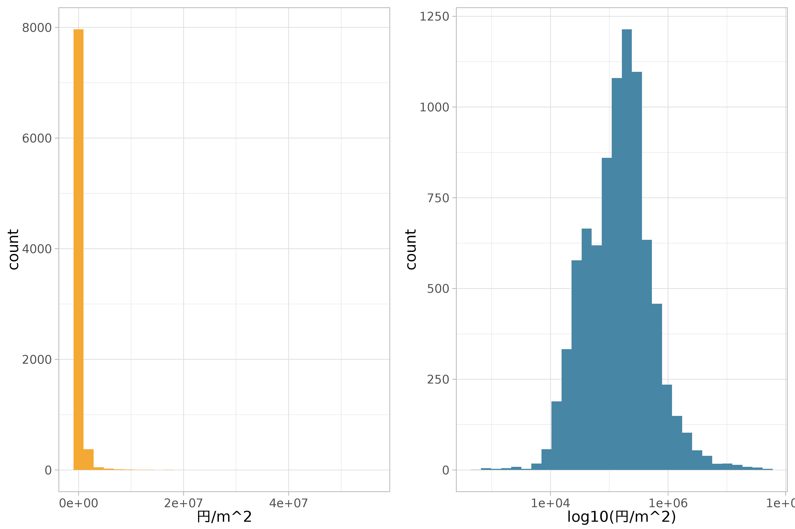

{:.input_area}
```R
source(here::here("R/setup.R"))
```


# 数値データの取り扱い

データ分析においてもっとも一般的な型が数値データです。商品の価格やウェブページのアクセス件数、株価の変動など多くのデータが数値で表されます。このことからわかるように、一言で数値データといっても実数から整数、マイナスの値を持つものまで多様な種類が存在します。

多くのモデルが数値の入力を前提としているため、数値をそのまま利用することもできます。しかし特徴量エンジニアリングが不要というわけではありません。具体的には線形回帰モデルでは、出力から得られる値の誤差が正規分布に従うことを仮定します。そのため正規分布とは異なる形状の分布をもつデータ、例えば離散値ではその仮定が成立しない可能性があります。この問題を解決するため、元のデータを正規分布に近似させるという特徴量エンジニアリングが有効になります。

良い特徴量というのはデータの特徴を強く反映します。連続的な数値の二値化あるいは離散化により、モデルの精度を改善できる見込みがあります。また数値以外のテキストや画像データを数値化した際、さらなる特徴量エンジニアリングが必要になることがあります。つまり数値データの処理は特徴量エンジニアリングの中で最も基本的な技と言えます。

前章で示した標準化や正規化も数値データの処理ですが、この章では数値変数をモデルに適した形式へと変換する手法を紹介します。元が数値でないデータの扱い各章で解説します。単一の変数を対象にした処理として対数変換、離散化、ハッシュ化を扱います。また複数の特徴量から新たな特徴量を生成する手法や変数間の相互作用について導入を行います。

## 数値データが抱える問題

数値データはありふれたデータ形式ですが、その反面数多くの問題を抱えていることがあります。その特徴をあげてみます。

- スケールが大きく異なる
- 歪んだ分布をもつ
- 大小の外れ値を含む
- 変数間で、線形では表現できないような複雑な関係を持っている
- 冗長な情報

これらの問題は、回帰か分類かという課題設定に応じて、適用するモデルの種類によって顕在化します。しかし適切なモデルを選択することで問題のいくつかを軽減できる見込みもあります。例を見てみましょう。

k近傍法やサポートベクターマシンは、特徴空間上の外れ値の影響を受けやすい性質があります。一方で、実際の値ではなく順位化されたデータを利用する木ベースのモデルでは外れ値の影響を軽減可能です。また互いに説明変数の間で強い相関がある変数を重回帰モデルに組み込むと、わずかに値が変動しただけで係数が大きく異なってしまいます。このような状況では部分最小二乗法を用いることで説明変数の相関を無相関化できます。つまり、問題のあるデータに対しては適切なモデルとデータの変換を選択することによりある程度の対策が可能なのです。

数値データに対する特徴量エンジニアリングの作戦は次の3種類に分けて考えられます。

- 個々の数値変数の問題について直接対処する
- 変数変換
- 変数間の関係を見つめ直す

まずは個別の説明変数に対して有効な

変換方法を紹介します。

## 対数変換

数値データの特徴量エンジニアリングとして最初に検討するのが対数変換です。これは[前処理](01/tidy-data)で扱ったスケール変換とは対象の変数の値を変えるという意味では同じですが、大きな違いがあります。スケール変換では変数のばらつきを元にする変換のため、変換後の値でも分布は変わりませんでした。しかし対数変換ではデータの分布を変えます。

対数変換の効果が大きいのは偏りがある数値データです。次の図は地価公示データの地価をヒストグラムにプロットした図と、同じデータに対数変換を施したものです。


{:.input_area}
```R
p_base <- 
  df_lp_kanto %>% 
  ggplot(aes(posted_land_price)) +
  geom_histogram(bins = 30, show.legend = FALSE) +
  scale_fill_identity()

p1 <- p_base + 
  aes(fill = ds_col(1)) +
  xlab("円/m^2")
p2 <- p_base + 
  aes(fill = ds_col(5)) +
  xlab("log10(円/m^2)") +
  scale_x_log10()

plot_grid(
  p1,
  p2,
  ncol = 2)
```




対数変換には次の特徴があります。

- 特徴量のスケールが大きい時はその範囲を縮小し、小さい時は拡大します。これにより、裾の長い分布を正規分布の形に近づけることが期待されます。
- 平均値が大きいグループほど分散が大きい場合には、対数変換により等分散性が確保されることが多い

一方、10を底とするこの対数変換では、0やを扱うことができないという欠点もあります。そのため、強引に正の値となるような加算の処理をしてから対数変換を行うことがあります。このような処理に対して、足し合わせる数値を下駄に例えて「下駄を履かせる」と表現することがあります。


{:.input_area}
```R
log10(0)
log10(-1)
log10(0 + 1)
```


ただしこの「下駄」も負値についても非負値とするために「...を足す」のような処理をすると解釈が難しくなる問題があります。ここでは詳しく解説しませんが、0や負値を含んだ特徴量を扱えるYeo-Johnson変換 (Yeo-Johnson Power Transformations) が効果的な時があります。


{:.input_area}
```R
df_lp_kanto %>% 
  ggplot(aes(posted_land_price, distance_from_station, color = prefecture)) +
  geom_point() +
  scale_fill_identity() +
  scale_x_log10() +
  scale_y_log10()
```


### Box-Cox変換

- パラメータ \lambda を変更することで、対数変換 (\lambda = 0)、平方根変換 (\lambda = 0.5)、逆数変換 (\lambda = -1.0)
- 平方根変換 はカウントデータに適する?
- 対数変換よりもBox-Cox変換の方が裾を縮小させることが期待される
- 0より大きい値
    - 0および負値に対応したYeo-Johnson変換については説明しない


{:.input_area}
```R
ggplot(df_lp_kanto, aes(acreage)) +
  geom_histogram(bins = 30)

rec <- 
  recipe(~ acreage, data = df_lp_kanto)

rec %>%
  step_sqrt(all_predictors()) %>%
  prep(training = df_lp_kanto) %>%
  juice(all_predictors()) %>%
  ggplot(aes(acreage)) +
  geom_histogram(bins = 30)

rec %>%
  step_log(all_predictors()) %>%
  prep(training = df_lp_kanto) %>%
  juice(all_predictors()) %>%
  ggplot(aes(acreage)) +
  geom_histogram(bins = 30)

rec %>% 
  step_BoxCox(all_predictors()) %>% 
  prep(training = df_lp_kanto) %>% 
  juice(all_predictors()) %>% 
  ggplot(aes(acreage)) +
  geom_histogram(bins = 30)
```


## ロジット変換

- 百分率や比率データ
    - 0から1の範囲に含まれる値を確率として表現。
    - 変換前と変換後の値を、散布図にすると曲線を描く


{:.input_area}
```R
df_lp_kanto %>% skimr::skim()
d <- 
  df_lp_kanto %>% 
  transmute(frontage_ratio = frontage_ratio * 0.01)

rec <- 
  recipe(~ frontage_ratio, data = d)

df_transed <- rec %>% 
  step_logit(all_predictors()) %>% 
  prep(training = d) %>% 
  juice(all_predictors()) %>%
  rename(frontage_ratio_trans = frontage_ratio) %>% 
  bind_cols(d)

df_transed %>% 
  ggplot(aes(frontage_ratio, frontage_ratio_trans)) +
  geom_point()
```


## Binning


<!-- fe-categorical? -->


## シークエンス

- 移動平均
- 外れ値をもつ場合には平滑化が有効


{:.input_area}
```R
mod_rec <- 
  df_lp_kanto %>%
  select(posted_land_price, number_of_floors) %>% 
  recipe(formula = ~ .)

df_trans <- 
  mod_rec %>% 
  step_BoxCox(all_numeric()) %>% 
  prep() %>% 
  juice()

p1 <- df_lp_kanto %>% 
  ggplot(aes(posted_land_price)) +
  geom_histogram(bins = 30, fill = ds_col(1))

p2 <- df_trans %>% 
  ggplot(aes(posted_land_price)) +
  geom_histogram(bins = 30, fill = ds_col(5))

plot_grid(p1, p2)
```


## カウントデータの取り扱い

<!-- ビン（レンジ）カウンティング -->

## 二値化

- スケールによる影響を緩和するためにカウントデータを離散化

地上階数はカウントデータとして与えられています。

カウントした値を階級にまとめる方法です。

階級データには順序が与えられることになります。

### 固定幅による離散化

- 各階級の範囲をあらかじめ決めておく
- 階級区分に規則性がある場合とない場合
    - 年齢... 10歳区切り。階級幅は一定で規則性がある
    - 年齢... ライフスタイルによる区切り。規則性がない
- 10の累乗 (0~9, 10~99, 100~9999) 指数関数的

### 分位数による離散化

- 均等に


{:.input_area}
```R
# 5段階の階級を設定
binned <- 
  discretize(df_lp_kanto$distance_from_station, 
             cuts = 5, 
             infs = FALSE, 
             keep_na = FALSE,
             prefix = "distance_bins")
table(predict(binned, df_lp_kanto$distance_from_station))
```


{:.input_area}
```R
# box-cox変換 ---------------------------------------------------------------
# モデルを定義... 線形回帰モデル
spec_lin_reg <- linear_reg()
# エンジンを指定... stats::lm
spec_lm <- set_engine(spec_lin_reg, engine = "lm")


# 同じ結果... formulaで参照するのではなく、x,yにデータを与える
fit_xy(spec_lm, 
       y = df_train_baked %>% pull(posted_land_price),
       x = df_train_baked %>% 
         select(-posted_land_price)) %>% 
  tidy()

df_train_price_log <-
  df_train %>%
  mutate(price = log10(posted_land_price),
         distance_from_station = log10(distance_from_station + 1))

# df_train %>% 
#   recipe(mod_formula) %>% 
#   step_BoxCox(all_outcomes(), lambdas = 1.0) %>% 
#   step_log(distance_from_station, base = 10) %>% 
#   prep(training = df_train) %>% 
#   juice()

# stanエンジン (rstan::stan())
spec_stan <- 
  spec_lin_reg %>% 
  set_engine(engine = "stan", chains = 4, iter = 1000)

fit_stan <- fit(
  spec_stan,
  mod_formula2,
  data = df_train)

coef(fit_stan$fit)
fit_stan %>% broom::tidy()

# knn
fit_knn <-
  nearest_neighbor(mode = "regression", neighbors = 4) %>% 
  set_engine("kknn") %>% 
  fit(mod_formula2, data = df_train)

predict(fit_knn, new_data = df_test %>% 
          select(-posted_land_price))

car::powerTransform(df_lp_kanto$posted_land_price)

library(car)
summary(p1 <- powerTransform(cycles ~ len + amp + load, data = Wool))
# fit linear model with transformed response:
coef(p1, round=TRUE)
summary(m1 <- lm(bcPower(cycles, p1$roundlam) ~ len + amp + load, Wool))
```


{:.input_area}
```R
df_lp_kanto %>% 
  count(current_use) %>% 
  ggplot(aes(forcats::fct_reorder(current_use, n), n)) +
  geom_bar(stat = "identity") +
  coord_flip()
df_lp_kanto %>% 
  count(use_district) %>% 
  ggplot(aes(forcats::fct_reorder(use_district, n), n)) +
  geom_bar(stat = "identity") +
  coord_flip()

recipe(formula = mod_formula3, data = df_train)

mod_rec <- 
  recipe(formula = mod_formula3, data = df_train) %>% 
  step_log(all_outcomes(), base = 10) %>% 
  # 5%未満を "other"
  step_other(use_district, threshold = 0.05) %>% 
  step_dummy(all_nominal())

mod_rec

# recipe (define) -> prep (calculate) -> bake/juice (apply)
mod_rec_trained <- prep(mod_rec, training = df_train, verbose = TRUE)

lp_test_dummy <- bake(mod_rec_trained, new_data = df_test)
names(lp_test_dummy) # 1住居がない（一番多い）
```


{:.input_area}
```R
# interaction
p <- ggplot(df_train,
       aes(distance_from_station, posted_land_price)) +
  geom_point() +
  scale_y_log10()

p +
  geom_smooth(method = "loess")

# MASS::rlm()
library(MASS)
p + 
  facet_wrap(~ gas_facility, ncol = 1) +
  geom_smooth(method = "rlm")

mod1 <- lm(log10(posted_land_price) ~ distance_from_station, data = df_train)
mod2 <- lm(log10(posted_land_price) ~ distance_from_station + gas_facility + distance_from_station:gas_facility , data = df_train)

anova(mod1, mod2)

mod_formula4 <- formula(posted_land_price ~ distance_from_station + gas_facility)
df_train %>% 
  recipe(mod_formula4, data = .) %>% 
  step_log(all_outcomes()) %>% 
  step_dummy(gas_facility) %>% 
  step_interact(~ starts_with("gas_facility"):distance_from_station) %>% 
  prep(training = df_train) %>% 
  juice()
```


<!-- ビニングや多項式特徴量、-->

## 交互作用特徴量

## 次元集約によると特徴量の作成

- PCA, ICA
- L2ノルム正則化... ベクトル空間に対して「距離」を与えるための数学の道具

過学習を防ぐためでもある

<!-- reduction... ここでは概要説明のみ。詳しくは該当する章で-->

## まとめ

> 対数をとるモデルと対数をとらないモデルのどちらか一方が「正しい」わけではない。あくまでも「そういう仮定を選んだ」ということに過ぎない

数値特徴量

特徴量の管理、膨大に増えた特徴量の次元削減については別の章で解説します。

## 関連項目

- [特徴量選択](feature-selection)

## 参考文献

- Max Kuhn and Kjell Johnson (2013). Applied Predictive Modeling. (Springer)
