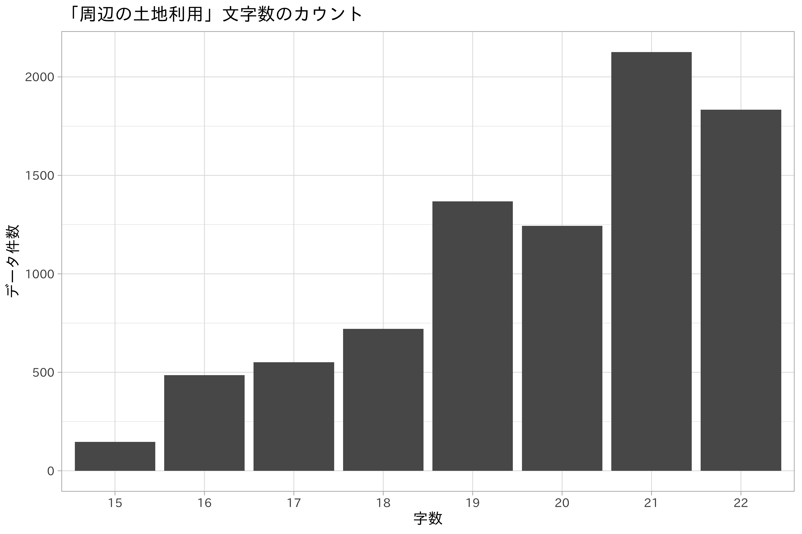

{:.input_area}
```R
source(here::here("R/setup.R"))
```


{:.input_area}
```R
library(textrecipes)
```


# テキストデータの取り扱い

テキストデータはカテゴリデータと同様に文字列で構成されますが、その違いはどこにあるのでしょう。カテゴリは有限の集合であることは述べました。一方のテキストは基本的にカテゴリより長く、ユニークな値をもつものです。

テキストデータを扱ううえで大事になってくるのは、文字の長さや区切り位置の有無、そして言語です。テキストデータ、つまり文書の処理は自然言語処理の領域に入ります。しかしいくつかの基本的な作業はデータ分析にも応用可能であり、カテゴリと同じく特徴量エンジニアリングにより数値化が可能です。

テキストデータの例として、地価公示データに記録されている土地利用の状況 (`surrounding_present_usage`) を例にします。このデータは比較的短文で、重複のあるデータで、本来はカテゴリとみなせるものです。しかし説明を簡単にするため、そしてこれまでのデータセットを利用し続けるために用います。また本来テキストデータとして扱う文字数はこれよりも多いはずですが、基本的な処理は共通です。

またここでは我々が普段扱う日本語のテキストデータに対象を制限しますが、時には英語を扱うこともあります。自然言語処理の分野では言語により、扱い方が異なります。特に日本語や中国語など、単語境界をもたない言語に対しては形態素解析などの前処理が必要になります。これらについてはここでの説明範囲を超えるので参考資料をみてください。

## 周辺の土地利用の状況

周辺の土地利用の状況 (`surrounding_present_usage`) は地価公示データのすべてのデータに対して与えられています。ユニークな件数を数えるとおよそデータの半分の数になります。

地価公示データの中から、周辺の土地利用の状況が記載された`surrounding_present_usage`を例に解説していきます。まずはこの変数にどのような文字情報が含まれているか確認しておきましょう。

```{r, eval=TRUE}
na.omit(df_lp_kanto$surrounding_present_usage)[seq_len(10)]
```

```{r, eval=TRUE}
df_lp_surrounding_present_usage_count <- 
  df_lp_kanto %>% 
  count(surrounding_present_usage, sort = TRUE)

nrow(df_lp_surrounding_present_usage_count)
```

```{r lp_surrounding_present_usage_nchar, eval=FALSE, echo=TRUE}
df_lp_kanto %>% 
  mutate(nchar = as.character(stringr::str_length(surrounding_present_usage))) %>% 
  count(nchar) %>% 
  ggplot(aes(nchar, n)) +
  geom_bar(stat = "identity") +
  ggtitle("「周辺の土地利用」文字数のカウント") +
  xlab("字数") +
  ylab("データ件数")
```



## テキストの前処理

テキストデータは、その独自の構造のために数値やカテゴリなどとは異なる前処理が必要になります。具体的には、空白文字列の削除、記号や区切り文字の削除、ユニコード正規化などです。


### 不要な文字列の削除

- ハッシュタグ
- URL

特定の文字列に変換するという手法も用いられます。対象の文字列を別のものに変える、すなわち置換の処理は正規表現によるパターンマッチを通して行われるのが一般的です。

### ユニコード正規化

意味的には同じでも、異なる表現方法が可能な文字の種類があります。

例えば「コンビニ」と半角文字の「コンビニ」は本質的には同じです。

丸囲いの数字なども必要なものは数字の情報で、丸に囲われているかどうかは重要ではありません。

大文字小文字の区別

「表記揺れ」と呼びます。ユニコード正規化はこうした表記の揺れを修正するために使われる方法です。

```{r, eval=TRUE, echo=TRUE}
df_lp_kanto %>% 
  filter(str_detect(surrounding_present_usage, "ＩＣ")) %>% 
  pull(surrounding_present_usage)

df_lp_prep <- 
  df_lp_kanto %>% 
  recipe(~ .) %>% 
  step_stri_trans(surrounding_present_usage, trans_id = "nfkc") %>% 
  prep(strings_as_factors = FALSE) %>% 
  juice()

df_lp_prep %>% 
  filter(str_detect(surrounding_present_usage, "IC")) %>% 
  pull(surrounding_present_usage)
```

ユニコード正規化は完全ではありません。また、どのような文字を「揺れ」とみなすかは分析者によって異なる可能性もあります。完全な表記揺れに対応するには、データに応じて辞書が必要になるでしょう。

### 文の分割 (トークン化)

トークン化

単語の間にスペースが入らない日本語文字列では、単語の分割が困難です。

分かち書き

```{r, eval= TRUE}
x <- na.omit(df_lp_kanto$surrounding_present_usage)[1]

tokenizer
```

## Bag-of-Words

* 文書を単語の出現回数のベクトルで表現。
    * 単語が文書中に現れない場合、対応する要素の値は0になる
    * 単語の並び、階層の概念を表現しない。Bag-of-wordsでこれらの意味はない
        * →テキストの意味を正しく理解したい場合にはあまり役立たない
            * Bag-of-n-Grams
* 全ての単語を同じようにしてカウントすると、必要以上に強調される単語が出る
    * 単純な出現頻度だけでは文書の特徴を表現できない
    * 「意味のある」単語が強調されるような特徴を表現する方法を用いるべき

```{r, eval = TRUE}
x <- na.omit(df_lp_kanto$surrounding_present_usage)[1]

tibble::tibble(x) %>% 
  tidytext::unnest_tokens(word, x) %>% 
  dplyr::mutate(word = forcats::fct_inorder(word)) %>% 
  dplyr::count(word, sort = FALSE)
```


```{r, eval=TRUE}
text_rec <- 
  df_lp_kanto %>% 
  recipe(~ surrounding_present_usage + .row_id) %>% 
  step_tokenize(surrounding_present_usage)

df_lp_token <- 
  text_rec %>% 
  prep() %>% 
  juice() %>% 
  tidyr::unnest(cols = c(surrounding_present_usage))

df_lp_token %>% 
  filter(.row_id == "13534")
```

## 単語の除去

Bag-of-Wordsでは、対象の変数に含まれる単語を元に特徴量が生成されますが、中には価値のない単語も含まれます。こうした単語をあらかじめ取り除いておくことは、特徴選択におけるフィルタ法の作業に相当します。

文章の特徴を反映しないような前置詞や冠詞などはその代表です。データ全体で出現頻度の少ない単語も役立つ可能性は低いです。こうした不要な単語が特徴量に含まれないよう、あらかじめ有用でない単語を除去するという方法が取られます。


### ストップワードによる単語除去

文書の内容に重要でないと考えられる単語をまとめて対象から除外する処理にストップワードが用いられます。ここでの重要でない、は文書中に頻繁に出現する句読点や「です」「ます」などの単語などです。ストップワードの選別には、言語に固有のリストを使うか、データセットに応じた頻度の高い単語のリストを作成するか、という選択肢があります。

```{r, eval = TRUE}
df_lp_kanto %>% 
  recipe(~ .) %>%
  step_rm(-acreage, -surrounding_present_usage) %>% 
  step_tokenize(surrounding_present_usage) %>% 
  step_stopwords(surrounding_present_usage, custom_stopword_source = 
                   c("アパート", "住宅", "等", "の", "が")) %>% 
  prep(training = df_lp_kanto) %>% 
  juice() %>% 
  tidyr::unnest(cols = c(surrounding_present_usage)) %>% 
  count(surrounding_present_usage, sort = TRUE)
```

### 出現頻度による単語のフィルタ

出現頻度の少ない単語も解析の際に障害となる可能性があります。これらは単純に出現頻度を数えてフィルタすることで除外可能です。

```{r}
text_rec %>%
  step_tokenfilter(surrounding_present_usage, min_times = 50) %>% 
  prep() %>% 
  juice() %>% 
  head(1) %>% 
  tidyr::unnest(cols = c(surrounding_present_usage))
```


## TF-IDF

TF-IDFは情報検索や文書推薦などで利用される特徴量の指標です。文章量が異なるデータでは、文書の長さによって出現する単語の数や回数が異なります。その影響を調整する（正規化する）働きを持ちます。

TF-IDFはTF (索引語頻度 Term Frequency)とIDF (逆文書頻度 Inverse Document Frequency)の積より求まります。以下の式により、文書中に多く出現する単語の影響が軽減され、希少な単語の価値を高めます。

$$
tf-idf = tf(w,d) \times idf(w)
$$

$$
tf(w,d) = bow(w,d) / [文書d内の単語数]
$$

$$
bow(w, d) = [文書d内の単語wの出現回数]
$$


$$
idf(w) = [全文書数N] / [単語wが含まれる文書数]
$$

```{r step_tfidf, eval=TRUE}
df_lp_kanto %>% 
  recipe(~ surrounding_present_usage + .row_id) %>% 
  step_tokenize(surrounding_present_usage) %>%
step_tfidf(surrounding_present_usage) %>% 
prep() %>% 
juice()
```

## 文字列のカウント

```{r}
d <- 
  df_lp_kanto %>% 
  sample_n(10) %>% 
  select(.row_id, surrounding_present_usage)

recipe(~ ., data = d) %>%
  step_tokenize(surrounding_present_usage, token = "words") %>% 
  prep(training = d, retain = TRUE) %>% 
  juice() %>% 
  tidyr::unnest(cols = c(surrounding_present_usage)) %>% 
  group_by(.row_id, surrounding_present_usage) %>% 
  mutate(n = n()) %>% 
  ungroup() %>% 
  arrange(desc(n))

recipe(~ ., data = d) %>% 
  step_count(surrounding_present_usage, pattern = "住宅", result = "count_house") %>% 
  prep(d) %>% 
  juice()
```

## 語幹処理 (ステミング)

形態素解析


## まとめ

- テキストの前処理で一般的な作業には限界があり、より精度の高い作業を行うにはデータに応じた辞書やリストが必要になる。
- 扱う言語によって前処理や特徴量エンジニアリングの適用範囲が異なる

## 関連項目

- [次元削減](../03/dimension-reduction)

## 参考文献

- Sarah Guido and Andreas Müller (2016). Introduction to Machine Learning with Python A Guide for Data Scientists (O'Reilly) (**翻訳** 中田秀基訳 (2017). Pythonではじめる機械学習
- 石田基広 (2017). Rによるテキストマイニング入門 第2版 (森北出版)
- Julia Silge and David Robinson (2017). [Text Mining with R A Tidy Approach](https://www.tidytextmining.com/) (O'Reilly) (**翻訳** 長尾高弘訳 (2018). Rによるテキストマイニング — tidytextを活用したデータ分析と可視化の基礎 (オライリー))
- Benjamin Bengfort, Tony Ojeda, Rebecca Bilbro (2018). Applied Text Analysis with Python Enabling Language-Aware Data Products with Machine Learning (O'Reilly)
- Alice Zheng and Amanda Casari (2018). Feature Engineering for Machine Learning (O'Reilly) (**翻訳** 株式会社ホクソエム訳 (2019). 機械学習のための特徴量エンジニアリング (オライリー))
