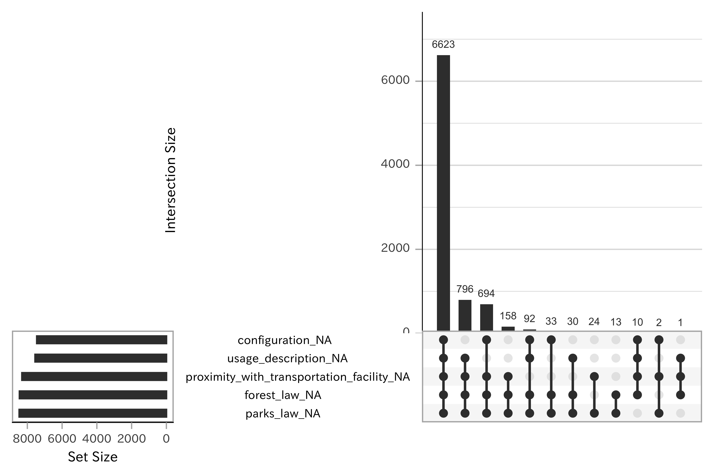
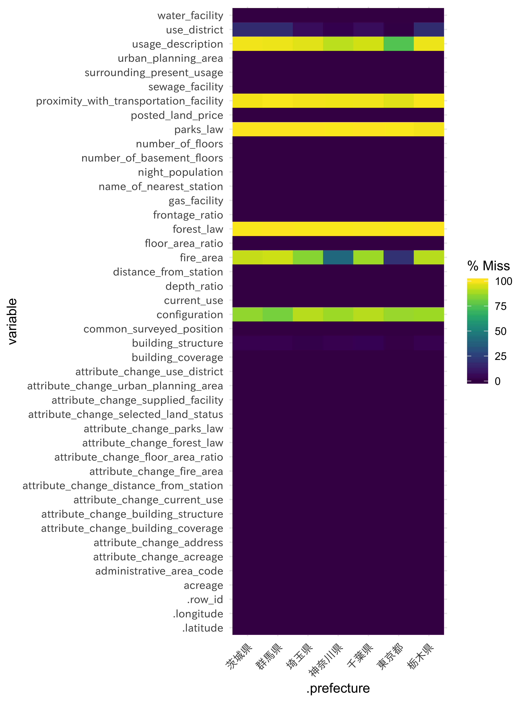
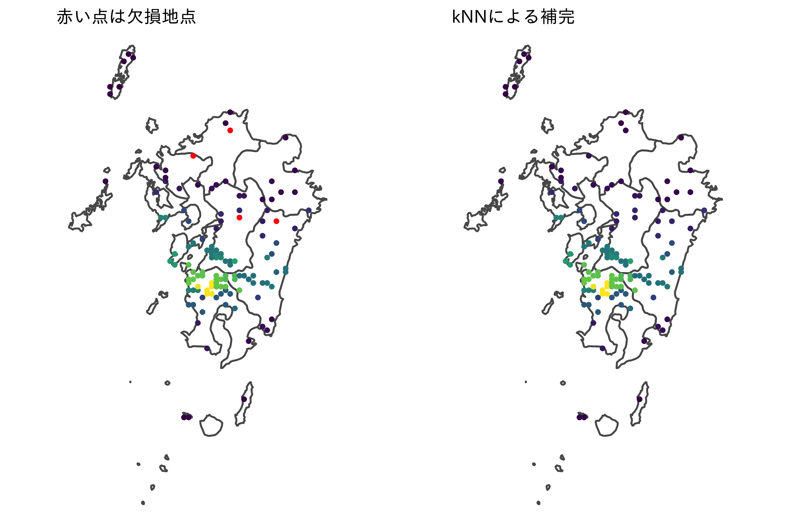

# 欠損データの処理


{:.input_area}
```R
source(here::here("R/setup.R"))
```


## 欠損データ

分析に利用するデータには多くの場合、なんらかの理由により記録されなかった値、欠損値 (欠測、欠落 missing data) が含まれます。全ての変数の値が観測されているデータを完全データ (complete data) と呼びます
。これに対して欠損が含まれるデータは不完全データ (incomplete data) と呼ばれます。 データ件数が増えるほど、なんらかの理由によりデータとなる傾向にあります。それは後に述べるように欠損がランダムな事象により生じることが多いためです。

ここではまず、欠損値があることのデメリットを確認し、欠損値に対する認識を深めます。続いて欠損発生のメカニズムを知り、欠損パターンを可視化します。最後にそれらを踏まえた上で欠損値への対策を練るようにします。

### 欠損データのデメリット

欠損値が含まれるデータを扱う上での問題点は次の3点が大きいです。

- 統計的処理が不可能になる
- 結果にバイアスが生じる
- データ資源が無駄になる

第一に、平均の算出など単純な集計値を求める作業ができなくなります。以下のコードはRでの算術平均の計算の実行例です。ベクトルxの2番目の要素が欠損値であるため`mean()`の返り値も欠損値です。


{:.input_area}
```R
x <- c(1, NA_real_, 3, 5)
mean(x)
```


不完全データでは平均値の算出すら行えないため、他の統計処理（例えば標準偏差や相関係数）も行えないということになります。より応用的には、データ分析に使われるサポートベクターマシン、glmnet、ニューラルネットワークといった予測モデルの多くが欠損値を許容できません。

では不完全データに対して統計処理を行うにはどうすれば良いでしょうか。RやPythonでは欠損値を含んだ要素に対してリストワイズ除去 (listwise deletion 完全ケース法とも呼びます)という方法が適用できます。リストワイズ除去は欠損値を含んだ観察行の値を全て削除し、擬似的に完全データを作り出します。先ほどの例ではベクトルが対象なのでベクトル中の欠損値が除去されます。表形式のデータフレームでは行削除が行われます。


{:.input_area}
```R
mean(x, na.rm = TRUE)
```


`mean(na.rm = TRUE)` を指定して実行すると欠損値を除いた平均値が算出できました。しかし、この値は欠損値を除いた3つの要素での平均値です。そのため、ベクトルxが完全データであった際の平均値とは異なる可能性があります。つまり欠損除去をしたことで分析結果が偏ってしまう可能性が生じます。これは欠損値の2つめの問題になります。例えば小学校でのクラスで身体測定を行う際、あるクラスにおいて高身長の生徒数名が欠席していたとします。するとそのクラスの平均身長は本来の値よりも過少な値を導くことになり、推定値にバイアスが出てしまいます。

最後の問題ですが、表形式のデータではリストワイズ除去の適用により、欠損ではない列の値も削除されてします。これは分析に利用可能なデータの件数を減らすことになり、分析の効率性や精度低下を招くおそれがあります。具体的にはモデルの推定量の標準誤差が増加します。

### 欠損のパターンと発生メカニズム

統計学においては、欠損は単純なパターンと非単調なパターンに分離されます。まずデータの欠損パターンから対処する方法が異なってきます。そのためまずはデータの欠損パターンとその比率について把握しておくことが肝心になります。

<!-- 欠損にパターンはあるか? -->

欠損データの発生メカニズムとして、手入力によるミス、観測装置の不調、回答拒否、途中離脱といったものが挙げられます。

Little and Rubin (1987; 2014) では欠損の発生メカニズムを以下の3つに区分しました。

- MCAR (Missing completely at random) 欠損が完全にランダム
- MAR (Missing at random) 欠損をデータ内で統制すればランダム
- MNAR (Missing not at random) 欠損がランダムではない
    
MCARは欠損メカニズムに関する最も強い過程です。それは欠損が完全に偶然に発生しているというものです。データ中で欠損は一定の確率で発生しますが、それはデータとは無関係に生じるものとみなされます。

MCARと似た欠損メカニズムとしてMARがありますが、こちらの欠損は観察されたデータに基づいてランダムに発生するものです。データ分析ではMARを仮定して解析を行うことが多くなります。それはあとで述べるようにMARを仮定した不完全データに対して、最尤法に基づく混合効果モデル (EMアルゴリズム) 、多重代入法など対策方法が用意されているためでもあります。

最後のNMAR (以前はNMARとも呼ばれていました) は欠損がランダムに発生するものではない、というものです。観察されているデータでは欠損値を説明できず、未知の値によって決まります。NMARへの対策として、欠損のメカニズムを組み込んだモデルを作成することが考えられますが複雑な作業が伴います。

### 欠損に対するアプローチ

1. 欠損値の除去
2. 欠損値を予測値で補完する方法 (imputation)
3. 不完全データとして尤度を記述する方法

上述のように、欠損データの除去は分析結果にバイアスをもたらすために優れた対策方法とは言えません。目安として、欠損の割合が10%未満であればリストワイズ法による欠損処理が有効とされますが、それ以上に欠損を含んだデータでは最尤法か多重代入法で対処するのが欠損データに対して一般的です。

また、データに外れ値が含まれる場合、それらを除外してからの代入が効果的とされます。代入には欠損していないデータを元に補完が行われるため、外れ値の影響を受けた偏った補完になってしまうためです。

## 欠損パターンの視覚化

欠損値の発生パターンを可視化するRパッケージとして、mice、VI、naniar、visdatなどがあります。ここではnaniarとvisdatを利用した例を紹介します。miceについては福島 (2015)や高橋・渡辺 (2017)を参考にしてください。

<!-- core_pkgs.Rに含まれているけど説明のため -->


{:.input_area}
```R
library(naniar)
library(visdat)
```


地価公示データを対象にデータ全体、各行・列でどの程度の欠損が含まれるかを調べます。

<!-- 巨大なデータの場合は...-->


{:.input_area}
```R
ncol(df_lp_kanto) * nrow(df_lp_kanto)

df_lp_kanto %>% 
  select(-starts_with(".")) %>% 
  n_miss()
```


12%のデータが欠損していることがわかりました。さらにこのデータに対してリストワイズ除去を適用したとしたら、データ件数がどれだけ減少するか確認しておきましょう。


{:.input_area}
```R
# リストワイズ除去を行うとデータ件数が大幅に減少します
df_lp_kanto %>% 
  drop_na() %>% 
  nrow()
```


なんと利用可能なデータが0件になってしまいました。これでは何もできません。そのため、リストワイズ除去はこのデータへの欠損処理としては有効でないことが示されました。

次にnaniarパッケージの関数を使って、データ全体の欠損情報を集約してみましょう。miss_df_propがデータ中の欠損の比率、miss_case_propが欠損を含まない行の比率です。


{:.input_area}
```R
df_lp_kanto %>% 
  miss_summary()
```


次に各列での欠損状況を調べます。`miss_var_summary()`が各列の欠損状況を整理してくれます。次のコードでは欠損が1件でもある変数について表示します。


{:.input_area}
```R
df_lp_kanto %>% 
  select(-starts_with(".")) %>% 
  miss_var_summary() %>% 
  filter(n_miss > 0)
```


全体の50%以上が欠損している列が6つ、さらに90%以上の欠損が3列もあります。リストワイズ除去で件数が大幅に減少してしまうのはこれの変数が影響しているようです。`vis_miss()`でデータ全体の欠損パターンを表示して確かめてみましょう。
このプロットは、データの各行・各列での欠損データと欠損していないデータを並べて表示するので、データ全体の欠損パターンを把握するのに役立ちます。


{:.input_area}
```R
df_lp_kanto %>% 
  select(-starts_with(".")) %>% 
  vis_miss()
```


このように直接の数値では情報を把握しきれない場合や複数の変数間でのパターンを把握したい場合には可視化が有効です。欠損データの可視化方法としてもう1つ、可視化の章でも扱ったヒートマップは欠損の状況を把握するのも利用可能です。


{:.input_area}
```R
df_lp_kanto %>% 
  add_n_miss() %>% 
  select(n_miss_all, everything())
```


{:.input_area}
```R
df_lp_kanto %>% 
  select(-starts_with(".")) %>% 
  gg_miss_upset()
```





{:.input_area}
```R
p <- 
  df_hazard %>% 
  ggplot(aes(outflowSediment_m3, landslideLength_m)) +
  geom_point()

cowplot::plot_grid(p, p + geom_miss_point())
```


{:.input_area}
```R
gg_miss_fct(x = df_lp_kanto, fct = .prefecture) +
  theme(axis.text = element_text(family = "IPAexGothic"))
```




configuretionの欠損はどの県でも高い割合で起きていますが、fire_areanについては東京都や神奈川県では他県よりも欠損が少ないようです。

### 時系列データの欠損補完


{:.input_area}
```R
df_hazard_kys$hazardDate %>% range()

df_hazard_kys %>% 
  select(hazardDate, precipitation_max_1hour) %>% 
  filter(hazardDate == "2006-07-01")

df_hazard_kys %>% 
  select(hazardDate, precipitation_max_1hour) %>% 
  gg_miss_span(precipitation_max_1hour, 
               span_every = 31)
```


（ウィンドウ）

<!-- 日付データの欠損で適当なのがないので、ダミーとしてビールデータの一部の日付を欠損させてデモ。 -->


{:.input_area}
```R
df_hazard %>% 
  filter(hazardDate == "2006-06-12") %>% 
  miss_var_span(hazardDate, span_every = 5)

df_hazard %>% 
  miss_var_span(hazardDate, span_every = 30)

df_beer %>% 
  gg_miss_span(date, span_every = 365)
```


## 欠損データへのアプローチ

### 欠損値に対するエンコーディング

データ上の欠損値を減らす方法として、対象の特徴量がカテゴリである場合には「欠損」自体を1つのカテゴリとみなしてエンコーディングするのも1つの方法です。これは特に意図的に欠損値として扱われているデータで有効です。地価公示データの説明 (http://www.land.mlit.go.jp/landPrice_/notes.html) を確認したところ、 形状 (configuration) の項目で「台形、不整形と特に表示しない限り四角形」とありました。これから、現在欠損している値を「四角形」と置き換えても良いと判断します。

その他、「不明」や「測定不可」として扱っても良い変数がないか確認しておきましょう。場合によっては多くの欠損がエンコーディング可能です。

### 代入法

欠損した数値データの情報を失わずに補完する方法を考えます。まずは定数や平均といった集計値を欠損値に代入する簡単な方法を示します。次に、より一般的な欠損への対策として多重代入法や最尤法を用いる例を紹介します。

Rではmice、Ameliaパッケージを使った欠損値補完が行えます。


{:.input_area}
```R
df_beer2018q2 %>% 
  miss_var_summary()
```


#### 平均値代入法

欠損値を補完するためにもっとも勘弁な手法は、変数の中央値や平均値といった統計値を代入することです。


{:.input_area}
```R
df_prep <-
  df_hazard %>% 
  st_drop_geometry() %>% 
  select(hazardType, maxRainfall_h, maxRainfallFor_24h)

# 欠損を無視した場合の平均、中央値
df_prep %>% 
  summarise_if(is.numeric, 
               list(mean, median), 
               na.rm = TRUE)

impute_hazard <- 
  df_prep %>% 
  recipe(hazardType ~ .) %>%
  step_medianimpute(maxRainfall_h) %>% 
  step_meanimpute(maxRainfallFor_24h)

prep(impute_hazard, 
     training = df_prep, retain = TRUE) %>% 
  juice() %>% 
  summarise_if(is.numeric, 
               list(mean, median), 
               na.rm = TRUE)
```


#### *k*近傍法の利用

*k*近傍法 (k-nearest neighbor algorithm) は特徴空間上で隣接するデータを元に、多数決での分類を行う手法です。クラス分類や回帰問題に利用されますが、特徴空間上の距離を利用して、データに含まれる欠損ではない値から欠損値を補うことが可能です。

近い値の平均値

<!-- DMwRを使った knnによる補完 step_knnimpute -->


{:.input_area}
```R
library(DMwR)

d <- 
  df_hazard_kys %>% 
  filter(hazardDate == "2006-07-22") %>% 
  select(precipitation_max_1hour, longitude, latitude)

d[c(110, 119, 120), ]

d_comp <- 
  d %>%
    as.data.frame() %>% 
  #  mutate(mechCode = as.factor(meshCode)) %>% 
  #  filter(is.na(precipitation_max_1hour)) %>% 
  knnImputation(k = 5) %>% 
  as_tibble()

d_comp[c(110, 119, 120), ]
```


{:.input_area}
```R
p1 <- 
  ggplot() +
  geom_sf(data = ne_kys, fill = "transparent") +
  geom_sf(data = d %>% 
            st_as_sf(coords = c("longitude", "latitude"), crs = 4326), 
          aes(color = precipitation_max_1hour),
          show.legend = FALSE,
          size = 0.8) +
  scale_color_viridis_c(na.value = "red") +
  theme_void(base_family = "IPAexGothic") +
  ggtitle("赤い点は欠損地点") +
  theme(text = element_text(size = 8))

p2 <- 
  ggplot() +
  geom_sf(data = ne_kys, fill = "transparent") +
  geom_sf(data = d_comp %>% 
            st_as_sf(coords = c("longitude", "latitude"), crs = 4326), 
          aes(color = precipitation_max_1hour),
          show.legend = FALSE,
          size = 0.8) +
  scale_color_viridis_c() +
  theme_void(base_family = "IPAexGothic") +
  ggtitle("kNNによる補完") +
  theme(text = element_text(size = 8))

plot_grid(p1, p2)
```





{:.input_area}
```R
d_comp %>% 
  st_as_sf(coords = c("longitude", "latitude"), crs = 4326) %>% 
  mapview::mapview(zcol = "precipitation_max_1hour")
```


### 決定木を使った欠損値補完

## まとめ

- 欠損を含んだ不完全データはデータ分析を行う上で避けては通れないほど頻繁にあります。またほとんどの統計モデルでは欠損を無視することはできません。欠損を含んだデータを不用意に削除すると推定に偏りをもたらします。そのため欠損に対して何らかの補完が有効な手段となります。
- 欠損の状況を把握することは、欠損に対するアプローチを考えるのに大変便利です。小さなデータセットであればヒートマップ、共起プロットで素早く全体の欠損を見渡せます。変数の大きなデータセットではPCAにより次元を圧縮したあとでの可視化が効率的です。
- 変数内で大部分の値あるいはすべての値が欠損していることもあります。この場合、該当の変数を除外することも1つの手です。またカテゴリ変数の場合は欠損を「欠損」という一つの水準とするのも選択肢の一つでしょう。

## 関連項目

- [探索的データ分析](../01/eda)

## 参考文献

<!-- textlint-disable prh -->

- 星野崇宏 (2009). 調査観察データの統計科学: 因果推論・選択バイアス・データ融合 (岩波書店)
- Little, R, and D Rubin. (2014). Statistical Analysis with Missing Data. (John Wiley; Sons.)
- 福島真太朗 (2015). データ分析プロセス (共立出版)
- 阿部貴行 (2016). 欠測データの統計解析 (朝倉書店)
- 高橋将宜・渡辺美智子 (2017). 欠測データ処理-Rによる単一代入法と多重代入法- (共立出版)
- Max Kuhn and Kjell Johnson (2019). Feature Engineering and Selection: A Practical Approach for Predictive Models (CRC Press)

<!-- textlint-enable prh -->

